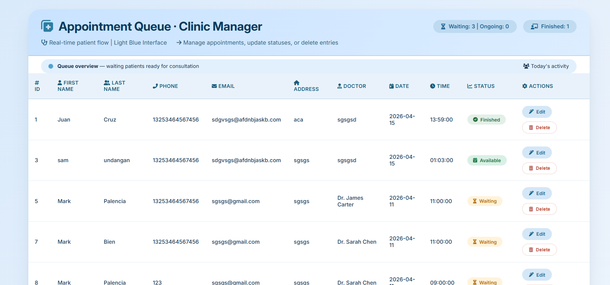
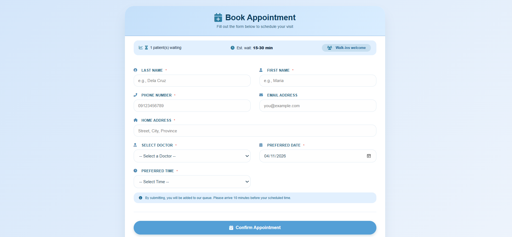
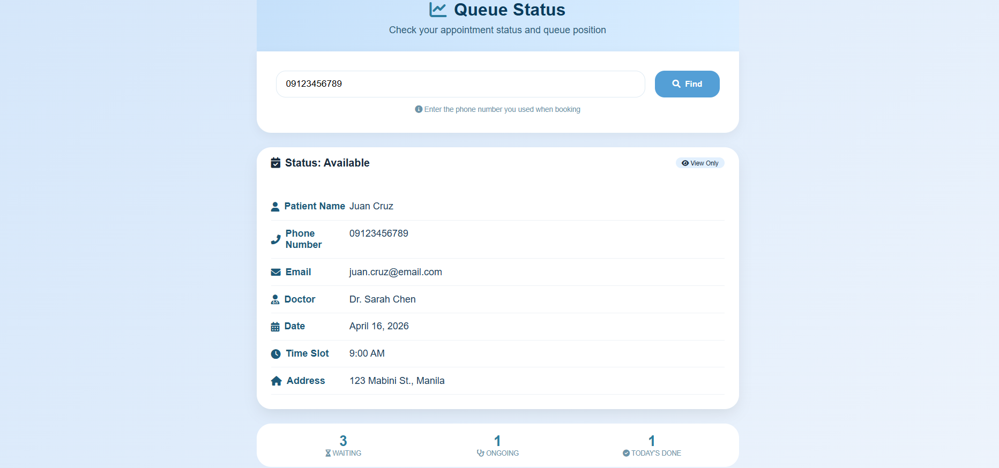
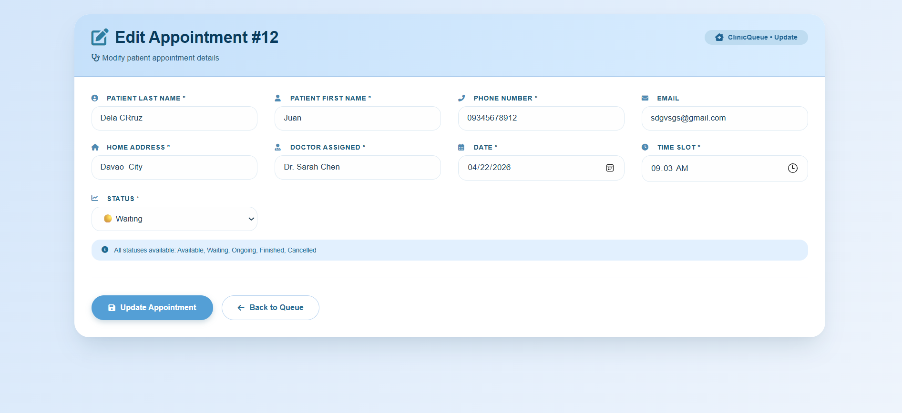

# Clinic Queue Management System (ClinicQueue)

A full-stack web-based clinic appointment and queue management system with separate interfaces for administrators and patients. Patients can book appointments online and track their queue position in real-time, while administrators can manage appointments, update statuses, and monitor clinic workflow.

---

## Table of Contents

- [Features](#-features)
- [Tech Stack](#-tech-stack)
- [System Requirements](#-system-requirements)
- [Installation Guide](#-installation-guide)
- [Database Setup](#-database-setup)
- [Database & Dummy Data Configuration](#-one-command-setup)
- [Project Structure](#-project-structure)
- [Usage Guide](#-usage-guide)
- [Screenshots](#-screenshots)
- [Author](#-author)

---

## Features

### For Administrators
| Feature | Description |
|---------|-------------|
| View All Appointments | Display complete appointment list in table format |
| Add Appointment | Create new appointments with patient details |
| Edit Appointment | Modify existing appointment information |
| Delete Appointment | Remove cancelled or outdated appointments |
| Status Management | Update status: Available, Waiting, Ongoing, Finished, Cancelled |

### For Patients (Clients)
| Feature | Description |
|---------|-------------|
| Self-Booking Portal | Book appointments without staff assistance |
| Queue Status Tracking | View appointment status and queue position |
| Real-time Updates | Auto-refresh every 30 seconds |
| View-Only Access | No editing capabilities - read-only |

### Technical Features
| Feature | Description |
|---------|-------------|
| Live Queue Statistics | Real-time counters for Waiting, Ongoing, Today's Done |
| Queue Position Calculator | Automatic position calculation per date |
| Responsive Design | Works on mobile, tablet, and desktop |
| AJAX Live Updates | Fetches stats without page reload |
| CSRF Protection | Security on all forms |
| Form Validation | Both client-side and server-side validation |

---

## Tech Stack

| Technology | Version | Purpose |
|------------|---------|---------|
| Laravel | 12.56.0 | Backend PHP Framework |
| PHP | 8.5.2 | Server-side scripting |
| MySQL | 5.7+ | Database |
| HTML5 | - | Structure |
| CSS3 | - | Styling (Light Blue Theme) |
| JavaScript | ES6 | AJAX, DOM manipulation |
| Font Awesome | 6.0 | Icons |
| Google Fonts | Inter | Typography |
| Blade | - | Templating Engine |
| Composer | 2.x | Dependency Manager |

---

## System Requirements

Before installing, ensure your system meets the following requirements:

| Requirement | Minimum Specification |
|-------------|----------------------|
| Operating System | Windows 10/11, macOS, or Linux (Ubuntu 20.04+) |
| PHP Version | 8.0 or higher |
| Composer | Latest version |
| MySQL | 5.7 or higher |
| Web Server | Apache / Nginx / Laravel Dev Server |
| RAM | 2GB minimum |
| Storage | 500MB free space |
| Browser | Chrome, Firefox, Safari, Edge (latest versions) |

### Required PHP Extensions
- BCMath
- Ctype
- Fileinfo
- JSON
- Mbstring
- OpenSSL
- PDO
- Tokenizer
- XML
- MySQLi

---

## Installation Guide

### Step 1: Clone the Repository

Open your terminal/command prompt and run:

git clone https://github.com/jrmoch/ClinicQueue.git
cd ClinicQueue
Alternative (Download ZIP):
Go to https://github.com/jrmoch/ClinicQueue
Click "Code" button → "Download ZIP"
Extract the ZIP file
Open terminal and navigate to the extracted folder
Step 2: Install PHP Dependencies via Composer

composer install
Step 3: Create Environment File

cp .env.example .env
If .env.example doesn't exist, create .env manually:
env
APP_NAME=ClinicQueue
APP_ENV=local
APP_KEY=
APP_DEBUG=true
APP_URL=http://localhost:8000

DB_CONNECTION=mysql
DB_HOST=127.0.0.1
DB_PORT=3306
DB_DATABASE=clinic_queue
DB_USERNAME=root
DB_PASSWORD=

SESSION_DRIVER=database
Step 4: Generate Application Key

php artisan key:generate

## Database Setup

Step 1: Create Database
Using phpMyAdmin:
Open http://localhost/phpmyadmin
Click "New" on the left sidebar
Enter database name: clinic_queue
Click "Create"
Using MySQL Command Line:
sql
CREATE DATABASE clinic_queue;
Using Laravel Artisan:
php artisan db:create

Step 2: Configure Database Connection
Edit your .env file with your database credentials:
env
DB_CONNECTION=mysql
DB_HOST=127.0.0.1
DB_PORT=3306
DB_DATABASE=clinic_queue
DB_USERNAME=root
DB_PASSWORD=your_password_here

Step 3: Run Migrations
php artisan migrate
If you get an error, try:
php artisan migrate:fresh

Step 4: Seed Database (Optional - Add Sample Data)
Create a seeder:
php artisan make:seeder AppointmentSeeder
Run seeder:
php artisan db:seed

## Database & Dummy Data Configuration

### One-Command Setup

To set up the entire database with dummy data, run:

php artisan migrate --seed

 Project Structure
ClinicQueue/
├── app/
│   ├── Http/
│   │   └── Controllers/
│   │       └── db_controller.php     # Main controller with CRUD operations
│   └── Models/
│       └── Appt.php                  # Eloquent Model for appointments
├── bootstrap/
├── config/                           # Laravel configuration files
├── database/
│   └── migrations/                   # Database migration files
├── public/
│   ├── css/
│   │   └── style.css                 # Master stylesheet (light blue theme)
│   └── index.php                     # Entry point
├── resources/
│   └── views/
│       ├── index.blade.php           # Admin appointment table
│       ├── pages/
│       │   ├── create.blade.php      # Admin create appointment form
│       │   └── edit.blade.php        # Admin edit appointment form
│       └── client/
│           ├── book.blade.php        # Client booking form
│           └── queue-status.blade.php # Queue status tracking page
├── routes/
│   └── web.php                       # All route definitions (CRUD + API)
├── storage/                          # Logs, cache, sessions
├── vendor/                           # Composer dependencies
├── .env                              # Environment configuration
├── .env.example                      # Example environment file
├── composer.json                     # PHP dependencies
├── package.json                      # Node dependencies
└── README.md                         # This file

## Usage Guide

For Administrators
1. View All Appointments
    Go to http://127.0.0.1:8000/
    Table displays all appointments with patient details
2. Add New Appointment
    Click "Add New Appointment" button
    Fill in patient information (First Name, Last Name, Phone, etc.)
    Select Doctor, Date, Time, and Status
    Click "Create Appointment"
3. Edit Appointment
    Click "Edit" button next to any appointment
    Modify any field (including status)
    Click "Update Appointment"
4. Delete Appointment
    Click "Delete" button next to any appointment
    Confirm deletion in popup

For Patients (Clients)
1. Book an Appointment
    Go to http://127.0.0.1:8000/book
    Fill in your personal information
    Select a doctor from the dropdown
    Choose preferred date and time
    Click "Confirm Appointment"
    You will be redirected to the queue status page
2. Check Queue Status
    Go to http://127.0.0.1:8000/queue-status
    Enter your phone number or email
    Click "Find"
    View your appointment details and queue position

## Screenshots

### Admin Dashboard

### Client Booking

### Queue Status

### Edit Appointment

Authors:
JASMINE REI P. AMONCIO.
BIEN NIÑO ENRIC N. ILIGAN
VERYLL SAM T. UNDANGAN
MARK VINCENT C. PALENCIA

